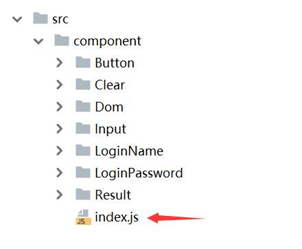
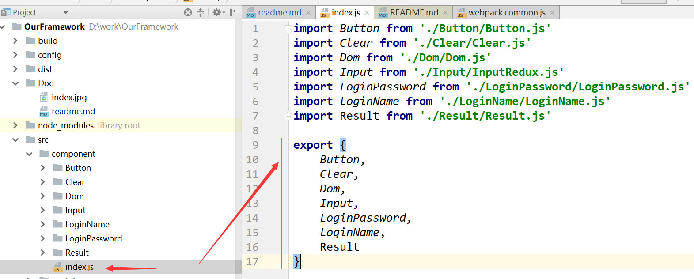

# React脚手架学习   
### 开发  
开发模式   
npm run dev  
### 生产   
生产模式   
npm run build 进行打包  
npm run server 启动node服务进行浏览  

#### 别名路径引入  
1、在webpack.common.js文件中配置的全部别名路径  
```
例：
resolve: {
        alias: {
            //图片别名
            'img': path.resolve(__dirname, '../src/public/images'),
            //图片别名
            'media': path.resolve(__dirname, '../src/public/media'),
            //字体别名
            'font': path.resolve(__dirname, '../src/public/font'),
            //data别名
            'data': path.resolve(__dirname, '../src/public/data'),
            //mock别名
            'mock': path.resolve(__dirname, '../src/mock'),
            //action别名
            'action': path.resolve(__dirname, '../src/redux/Action'),
            //reducer别名
            'reducer': path.resolve(__dirname, '../src/redux/Reducer'),
            //saga别名
            'saga': path.resolve(__dirname, '../src/redux/Saga'),
            //store别名
            'store': path.resolve(__dirname, '../src/redux/Store'),
            //容器别名
            'con': path.resolve(__dirname, '../src/containers'),
            //组件别名
            'com': path.resolve(__dirname, '../src/component'),
            //公用方法
            'method': path.resolve(__dirname, '../src/public/method')
        }
    }
       
 ```  
2、使用别名（引入导出）  
```
图片引入方式：
import A from 'img/A.jpg'  
单个.js文件引入方式：
import A frome "./A" 
import C frome "./C"
多个文件引入方式：
import {B1,B2,B3} frome "./B" 
```  
**导出(两种方式)：**  
```
（1）、export{...}导出可以导出多个
export {
A,
B1,B2,
C
}

（2）、export default 导出默认的唯一组件（只可导出一个）
export default A;
```
#### 组件群模块群使用统一单独文件(index.js)引入导出  
**component、containers、redux/Action、redux/Reducer、redux/Sage、redux/Store
等文件中定义各自的index.js**  
**示例图片:**  

  
   

**说明：使用这种方法：当项目文件庞大时可以清晰方便的使用路径文件，优化代码**  
**使用 import * as ...方式引入和使用:**  
```
//导入Con中的所有
import * as Con from "con/index";
使用:
Con.A;

```  
**部分导入方式**  
```
//部分导入
import {A,B1,B2} from "com/index"
import {A,B1,B2} from "con/index"
import {A,B1} from "action/index"
```


