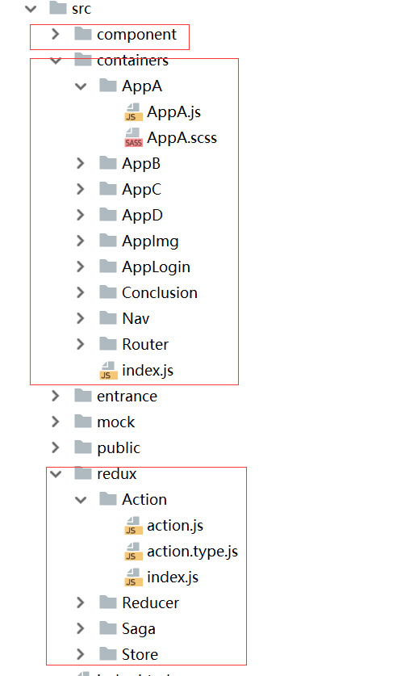

# React脚手架学习   
### 前言  
### 安装  
```bash
    # 克隆项目
    git clone git@github.com:xh476645818/OurFramework.git  

    # 安装依赖
    // 推荐使用npm安装
    npm install
    //or 使用下列安装可以解决下载速度过慢
    npm install --registry=https://registry.npm.taobao.org  
    //or 使用cnpm
    cnpm install
    #若已经使用cnpm 安装失败，请使用以下办法解决：
    1、删除项目目录中package-lock.json
    2、npm uninstall //删除package锁
    3、物理删除nod_modules
    4、npm install下载
 ```  
### 开发  
开发模式   
npm run dev  
### 生产   
生产模式   
npm run build 进行打包  
npm run server 启动node服务进行浏览  
### 访问  
**访问前需要配置config/project.config.json整体工程基本设置文件**  
```
{
  "devUrl": "192.168.3.8",  //开发访问地址,开发环境中的IP地址
  "devPort": "8080",        //开发访问端口,开发环境中的端口 
  "webTitle": "脚手架",     //项目名称，打包后的页面title标签内容
  "proUrl": "192.168.3.8", //生产访问地址，关联server.js 
  "proPort": 8024          //生产访问端口，关联server.js 
}
# 注意：启动项目前要修改项目的开发访问地址，否则会报错；
查看ip:
 打开windows命令窗口，快捷键 windows+R 输入：cmd进入DOS模式；
 输入：ipconfig 查看IP(IPv4 地址 即是本地IP)
```  
```
浏览器访问 http://192.168.3.8:8080
```  
### 打包配置文件  
**build目录为打包配置文件**  
```
├── build                        // 构建相关
│   ├── webpack.common.js        // webpack打包配置文件
│   ├── webpack.dev.js           // 开发环境打包配置
│   ├── webpack.pro.js           // 生产环境打包配置
# 注意：不要随便改动以上文件
```  
### 入口文件  
```
├── entrance                     // 入口文件
│   ├── app.js                   // 此文件是整个项目的主入口
│   ├── template.html            // 模板文件（处理Ie兼容）
```  
**通过配置template.html文件兼容Ie8+,此文件中主要是通过引入es5-sham.min.js、es5-shim.min.js、es6-sham.min.js、es6-shim.min.js（在webpack.common.js文件中，还需配置babel-polyfill来转换语法，实现浏览器不支持原生功能的代码）**  
```
#考虑到网络状况的原因转换兼容文件是存放在本项目中 src/public/ie/下
<script src="../public/ie/es5-shim.min.js"></script>
<script src="../public/ie/es5-sham.min.js"></script>
<script src="../public/ie/es6-shim.min.js"></script>
<script src="../public/ie/es6-sham.min.js"></script>
```  
#### 别名路径引入  
1、在webpack.common.js文件中配置的全部别名路径  
```
例：
resolve: {
        alias: {
            //图片别名
            'img': path.resolve(__dirname, '../src/public/images'),
            //图片别名
            'media': path.resolve(__dirname, '../src/public/media'),
            //字体别名
            'font': path.resolve(__dirname, '../src/public/font'),
            //data别名
            'data': path.resolve(__dirname, '../src/public/data'),
            //mock别名
            'mock': path.resolve(__dirname, '../src/mock'),
            //action别名
            'action': path.resolve(__dirname, '../src/redux/Action'),
            //reducer别名
            'reducer': path.resolve(__dirname, '../src/redux/Reducer'),
            //saga别名
            'saga': path.resolve(__dirname, '../src/redux/Saga'),
            //store别名
            'store': path.resolve(__dirname, '../src/redux/Store'),
            //容器别名
            'con': path.resolve(__dirname, '../src/containers'),
            //组件别名
            'com': path.resolve(__dirname, '../src/component'),
            //公用方法
            'method': path.resolve(__dirname, '../src/public/method')
        }
    }
       
 ```  
2、使用别名（引入导出）  
```
图片引入方式：
import A from 'img/A.jpg'  
单个.js文件引入方式：
import A frome "./A" 
import C frome "./C"
多个文件引入方式：
import {B1,B2,B3} frome "./B" 
```  
**导出(两种方式)：**  
```
（1）、export{...}导出可以导出多个
export {
A,
B1,B2,
C
}

（2）、export default 导出默认的唯一组件（只可导出一个）
export default A;
```
#### 组件群模块群使用统一单独文件(index.js)引入导出  
**component、containers、redux/Action、redux/Reducer、redux/Sage、redux/Store
等文件中定义各自的index.js**  
**示例图片:**  

  
   

**说明：使用这种方法：当项目文件庞大时可以清晰方便的使用路径文件，优化代码**  
**使用 import * as ...方式引入和使用:**  
```
//导入Con中的所有
import * as Con from "con/index";
使用:
Con.A;

```  
**部分导入方式**  
```
//部分导入
import {A,B1,B2} from "com/index"
import {A,B1,B2} from "con/index"
import {A,B1} from "action/index"
```  
### 目录文件命名规范  
**组件文件夹、组件.js文件及组件样式文件首字母要大写且使用大驼峰命名规范  
本项目使用sass，样式文件命名可以是：.scss或.css;命名格式与给所加样式的.js文件名相同  
其他文件使用小写；**  
  

### 样式文件导入  
```
//导入样式文件使用import
import "./AppA.scss";
```  
### 目录结构  
```shell
├── build                      // 构建相关  
├── config                     // 配置相关
├── doc                        // 文档说明图片
├── src                        // 源代码
│   ├── component              // 无状态组件
│   ├── containers             // 大组件容器
│   ├── entrance               // 入口文件
│   ├── mock                   // mock数据
│   ├── public                 // 公共文件（data、、图片、公共方法等）
│   │   ├── data               // 存放mock（假）数据
│   │   ├── font               // 图标文字
│   │   ├── ie                 // 兼容IE8+的转换包
│   │   ├── images             // 公共图片
│   │   ├── method             // 公共方法
│   ├── redux                  // redux相关
│   ├── index.html             // 入口html
├── .gitignore                 // git 忽略项
├── package.json               // package.json
├── server.js                  // server
├── readme.md                  // 脚手架项目文档说明
├── 脚手架需要.md               // 脚手架需要.md
```  


